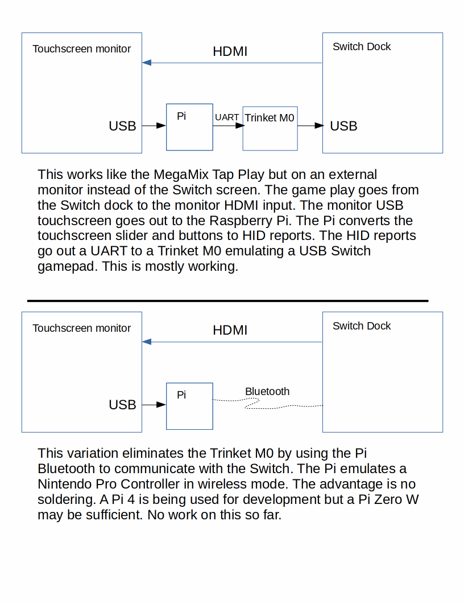
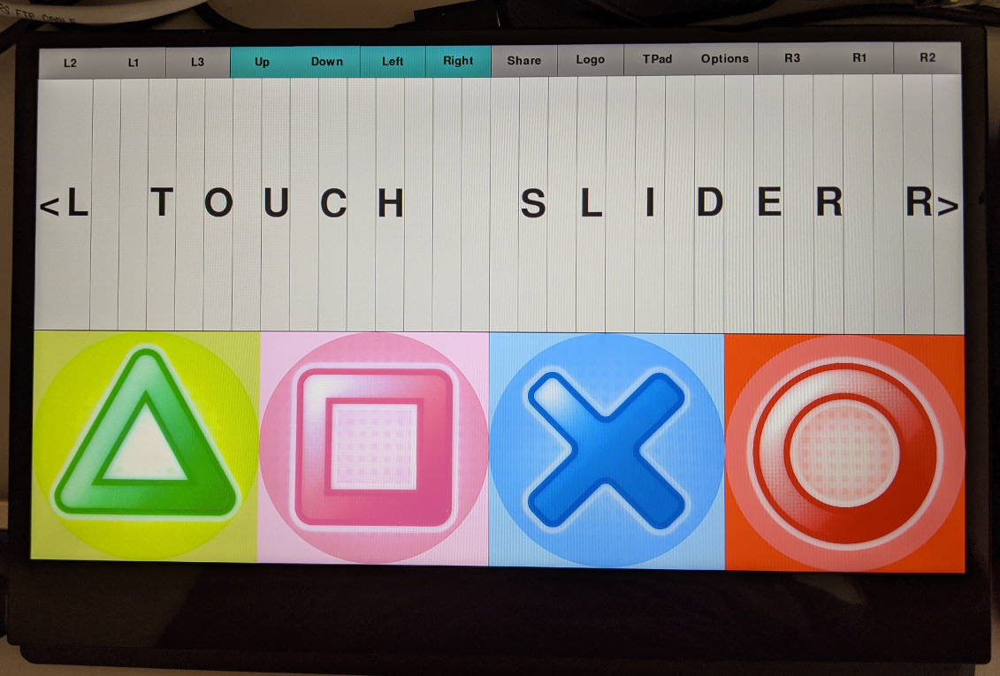

# Touchscreen Monitor Arcade Controller

Use a touchscreen monitor as an arcade controller for a Nintendo Switch.

The following shows the touch areas on the monitor. The top half has the
32 touch slider. The bottom half has four large buttons.

One option is to plug the Switch HDMI out into the touchscreen monitor.
This creates a the Switch MegaMix Tap Play mode but on an external monitor.
The system block diagram shows this option.

The other option is to plug the Switch HDMI out into a different monitor (no
touchscreen needed). Plug the touchscreen monitor into the Raspberry Pi HDMI
out so the touch areas are displayed.

In both cases, the touch USB out from the monitor goes to the Pi.

