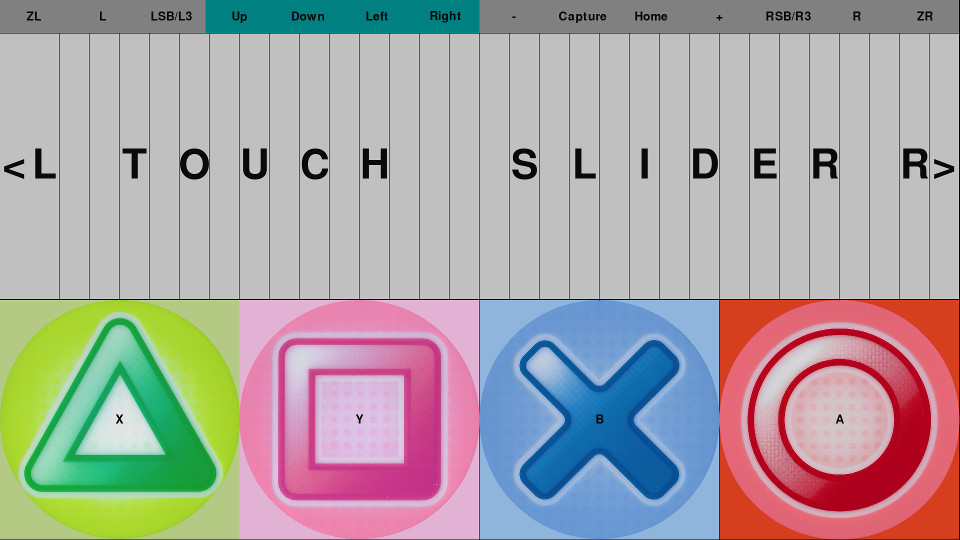

# Touchscreen Monitor Arcade Controller

Use a touchscreen monitor as an arcade controller for a Nintendo Switch or
PlayStation 4.


The following shows the touch areas on the monitor. The top half has the
32 region touch slider. The bottom half has four large buttons.

The latest version for the PlayStation 4 and Nintendo Switch includes gamepad
buttons such as direcitonal pad L1, R1, L2, R2, etc. on the top row.




One option is to plug the Switch HDMI out into the touchscreen monitor.
This creates a Switch MegaMix Tap Play mode but on an external monitor.
The system block diagram shows this option.

The other option is to plug the Switch HDMI out into a different monitor (no
touchscreen needed). Plug the touchscreen monitor into the Raspberry Pi HDMI
out so the touch areas are displayed. This is closer to the arcade experience.

In both cases, the touch USB out from the monitor goes to the Pi.

## Hardware

* Nintendo Switch in dock. Or PlayStation 4. No hacks or mods.
* Virzen Portable Monitor with 10-point touchscreen 13.3 inch.
* Raspberry Pi 4. Older Pi's including the Pi Zero may also work but have not
  been tested.
* Trinket M0 running NSGadget (Switch compatible gamepad software) or
  Trinket M0 running DS4Gadget (PS4 Dual Shock 4 compatible gamepad software)
* Optional breadboard, 2x20 breakout adapter, etc.
* Various HDMI and USB cables.
* MayFlash Magic-S Pro Controller Adapter (only for PS4)

## USB NSGadget
[This section is adapted from the NSGadget_Pi README.md]

NSGadget is an Adafruit Trinket M0 emulating an NS compatible gamepad. The UART
connection between the Pi and NSGadget runs at 2 Mbits/sec. The UART device
name is /dev/ttyAMA0.

|Trinket M0 |Raspberry Pi
|-----------|------------
|BAT        |5V0
|Gnd        |Gnd
|RX(3)      |D15(TXD)

The firmware/ directory has the NSGadget firmware.

Compiled programs can be burned into the Trinket M0 just by dragging and
dropping a UF2 file on to the Trinket M0 USB drive. There is no need to install
the Arduino IDE, source code, or USB serial device driver.

* Download the UF2 file of your choice.
* Plug in the Trinket M0 to the computer.
* Double tap the Trinket M0 reset button.
* When the TRINKETBOOT USB drive appears, drop the UF2 file on to the drive.
* Wait a few seconds until the Trinket M0 reboots.

## USB DS4Gadget

The hook up is the same as for the NSGadget but the firmware file name is
firmware/DS4Gadget.ino.bin.uf2.

WARNING: DS4Gadget does not support controller authentication so it
will stop working after about 8 minutes. The MayFlash Magic-S Pro controller
adapter solves this problem. I do not plan to add controller authentication.

```
PS4 -- MayFlash adapter -- Trinket M0/DS4Gadget -- Raspberry Pi
```

## Prepare the Pi
[This section and its two subsections are adapted from the NSGadget_Pi README.md]

Install Raspberry Pi OS (formerly known as Raspbian) Buster Desktop. Update to
the latest version.

```
sudo apt update
sudo apt full-upgrade
sudo reboot
```

### Prepare /dev/ttyAMA0

If the Pi has built-in Bluetooth (Pi 3, Pi 3+, Pi 4, Pi zero W) disable
Bluetooth to free up the PL011 UART.

The following is from /boot/overlays/README.

```
Name:   disable-bt
Info:   Disable onboard Bluetooth on Pi 3B, 3B+, 3A+, 4B and Zero W, restoring
        UART0/ttyAMA0 over GPIOs 14 & 15.
        N.B. To disable the systemd service that initialises the modem so it
        doesn't use the UART, use 'sudo systemctl disable hciuart'.
Load:   dtoverlay=disable-bt
```

```
sudo systemctl disable hciuart
sudo nano /boot/config.txt
```
Add `dtoverlay=disable-bt` as the last line of config.txt. Save and exit.

Turn off the login shell on /dev/ttyAMA0. This is necessary even if the Pi does
not have Bluetooth.

```
sudo raspi-config
```

* Select `Interfacing Options`.
* Select `P6 Serial`.
* Disable the login shell.
* Enable the serial interface.
* Exit raspi-config

```
sudo reboot
```
### Installing pygame 2.0.0-dev6

pygame 1.9 does not support the FINGERUP, FINGERDOWN, and FINGERMOTION events
so this is required.

```
sudo apt install python3 python3-pip python3-serial libsdl2-ttf-2.0-0
python3 -m pip install -U pygame==2.0.0.dev6 --user
git clone https://github.com/touchgadget/toucharcade
cd toucharcade
python3 pdtouch.py
```

## Project Diva Touchscreen

pdtouch.py displays a Project Diva controller, reads touches, and writes
gamepad button presses to the game console. It currently supports
PlayStation 4 and Nintendo Switch.

The `--slider==normal` option sends joystick movements for slides. Use
"--slider=dedicated" when using a dedicated arcade controller. Note the English
version of PS4 Future Tone does not support dedicated mode. The Japanese
version supports dedicated mode. The Nintendo Switch supports both modes but
the dedicated controller mode defaults off.

### Nintendo Switch

```
python3 pdtouch.py --console=switch --slider=normal
python3 pdtouch.py --console=switch --slider=dedicated
```

### PlayStation 4

```
python3 pdtouch.py --console=ps4 --slider=normal
python3 pdtouch.py --console=ps4 --slider=dedicated
```

## Related projects

See https://github.com/gdsports/NSGadget_Pi for other ways to use a Pi with a
Switch.

To emulate Switch controllers over Bluetooth, see https://github.com/mart1nro/joycontrol.
It would be nice to use this to eliminate the Trinket M0 and all soldering.

For another Python project that emulates a wireless Nintendo Pro Controller,
see https://github.com/Brikwerk/nxbt.

## Helpful Resources

* http://pol.dip.jp/diva/ is in Japanese but Google Tranlate helps. The video
  inspired me to build a controller although the hardware I use is very
  different.

* https://www.projectdiva.net/community/threads/project-diva-homemade-controllers.1465/
  has helpful discussion by controller builders.

